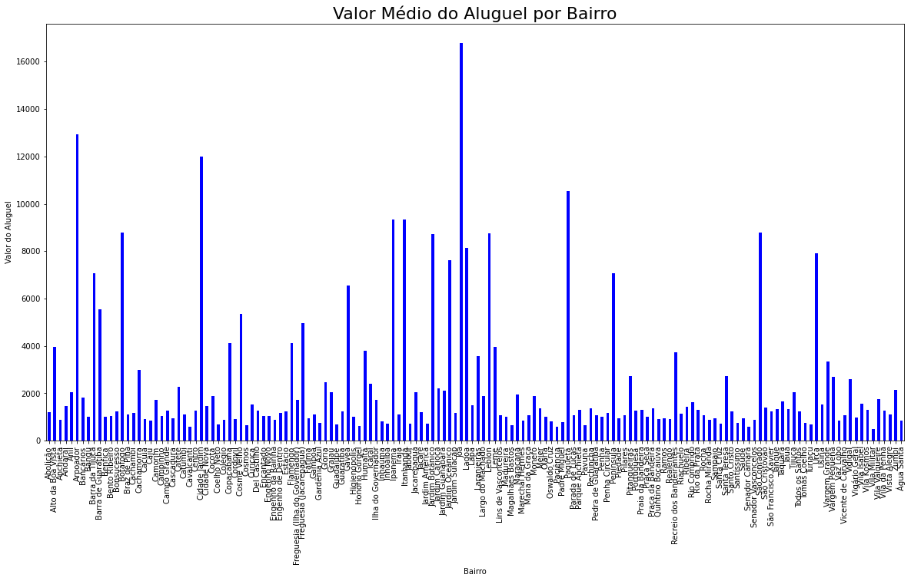
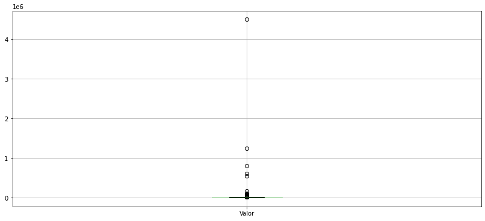
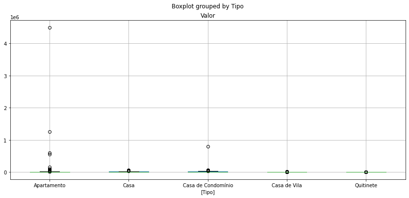

# Análise de Dados

Projeto de Análise de Dados Para Uma Seguradora 

<a href="#sobre"> Sobre - </a>
<a href="#tecnologias">Tecnologias - </a>
<a href="#updates">Solicitações - </a>
<a href="#autor">Autor</a>

<h4 align = "center">
✔️Projeto Concluído✔️

</h4>

# Sobre

Essa análise de Dados tem como objetivo atender os pedidos realizados por uma seguradora.   
Nesse projeto serão aplicados conhecimentos de python e suas bibliotecas voltadas para a análise e tratamento de dados.

# Tecnologias
* Python
* Jupyter Notebook

**Biblioteca(s)**
* Pandas
* Matlplotlib 

# Solicitações
- [x] Seleção dos tipos de imóveis.
- [x] Uma nova base de dados contendo somente imóveis residênciais.
- [x] Frequência das Seguintes Seleções
    - [x] Número de Imóveis classificados com tipo 'Apartamento'
        - 19532
    - [x] Número de Imóveis classificados com tipos 'Casa', 'Casa de Condomínio' e 'Casa de Vila'
        - 2212
    - [x] Número de Imóveis com área entre 60 e 100 metros quadrados, incluindo os limites.
        - 8719
    - [x] Número de Imóveis que tenham pelo menos 4 quartos e aluguel menor que R$ 2.000,00.
        - 41
- [x] Tratando Valores Nulos
- [x] Novas Variáveis
    - [x] Valor do Metro Quadrado
    - [x] Tipos Agregados de Residências 
        - Casas e Condominios  
- [x] Gráfico Com o Valor Médio do Aluguel Por Bairro (Todos os Bairros)  

    
- [x] Remover Todas Outliners 
    - [x] Análise Geral
    

    - [x] Análise Por Grupo
    

# Autor

* Gabriel Barbosa
* 27 Anos
* Estudante de Data Science
* Analista e Desenvolvedor de Sistemas
* Linkedin: https://www.linkedin.com/in/gabriel-barbosa-j/
* Instagram: https://www.instagram.com/gabrielbarbosa.j/
